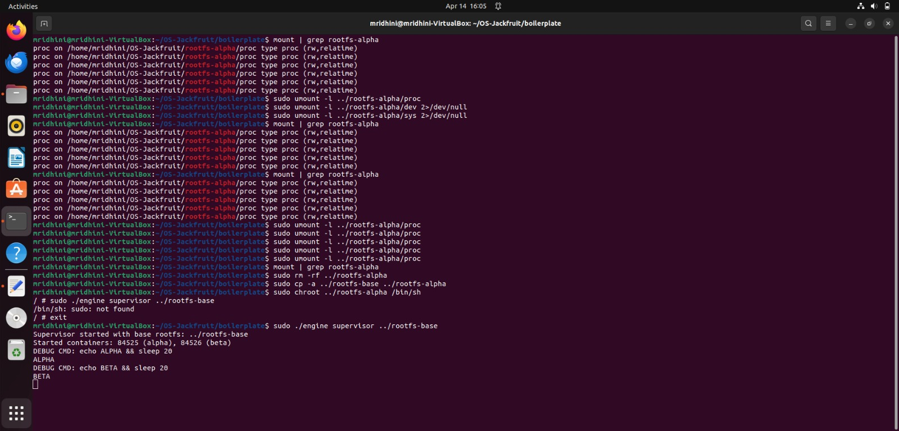
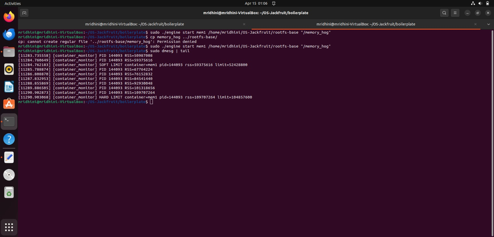

Multi-Container Runtime with Kernel Memory Monitor
Team Information
Name	SRN
Manasa	PES1UG24CS258
Mridhini M R	PES1UG24CS277
Build, Load and Run Instructions

This project was tested on **Ubuntu 22.04/24.04.

Install Dependencies
sudo apt update
sudo apt install build-essential linux-headers-$(uname -r)
Build Project
cd boilerplate
make

This builds:

engine (container runtime)
monitor.ko (kernel module)
workload programs
Load Kernel Module
sudo insmod monitor.ko

Verify:

ls -l /dev/container_monitor
Start Supervisor
sudo ./engine supervisor ./rootfs-base
Create Container Root Filesystems
cp -a ./rootfs-base ./rootfs-alpha
cp -a ./rootfs-base ./rootfs-beta
Start Containers
sudo ./engine start alpha ./rootfs-alpha /bin/sh --soft-mib 48 --hard-mib 80
sudo ./engine start beta ./rootfs-beta /bin/sh --soft-mib 64 --hard-mib 96
List Running Containers
sudo ./engine ps
View Container Logs
sudo ./engine logs alpha
Run Workload Experiments

CPU workload:

./cpu_hog

Memory workload:

./memory_hog

I/O workload:

./io_pulse
Stop Containers
sudo ./engine stop alpha
sudo ./engine stop beta
Inspect Kernel Logs
dmesg | tail
Unload Kernel Module
sudo rmmod monitor
Engineering Analysis

Isolation Mechanisms

Container isolation is implemented using Linux namespaces, a kernel feature provided by Linux.

Three namespaces are used:

PID Namespace

Each container has its own process ID space.
Processes inside the container see PID 1 as their init process.

UTS Namespace

Allows each container to have its own hostname.
Provides isolation of system identity.

Mount Namespace

Each container sees a different filesystem tree.
Prevents containers from accessing host files.

Filesystem isolation is achieved using chroot or pivot_root, which changes the process root directory so that the container cannot access files outside its rootfs.

However, some resources remain shared with the host kernel:

CPU scheduler
physical memory
kernel modules
network stack (unless additional namespaces are used)

This demonstrates how containers provide process isolation without full hardware virtualization.

Supervisor and Process Lifecycle

The supervisor process acts as the parent process for all containers.

This design is useful because:

It centralizes container lifecycle management.
It maintains metadata about running containers.
It handles process reaping when containers exit.

When a container is started:

The supervisor calls clone() to create a child process.
The child enters new namespaces.
The container workload begins execution.

The supervisor maintains parent-child relationships and uses waitpid() to reap terminated containers, preventing zombie processes.

Signals can also be propagated from the supervisor to containers for operations such as stopping or killing them.

IPC, Threads, and Synchronization

The system uses multiple IPC mechanisms.

Example IPC mechanisms include:

UNIX domain sockets or pipes for CLI-supervisor communication
shared memory for logging
ioctl communication between user space and kernel module
Bounded Buffer Logging

The logging system uses a producer-consumer model.

Components:

Producers: container runtime threads generating log messages
Consumer: logging thread writing logs to disk

Synchronization primitives used:

mutex for mutual exclusion
condition variables for signaling

Without synchronization:

race conditions could occur where multiple threads write to the buffer simultaneously
logs could become corrupted
data could be overwritten

The bounded buffer prevents overflow by limiting buffer size and forcing producers to wait if the buffer is full.

This prevents:

lost log messages
data corruption
deadlock situations
Memory Management and Enforcement

The kernel monitor measures RSS (Resident Set Size).

RSS represents:

the amount of physical memory currently used by a process.

However, RSS does not include:

swapped memory
shared pages counted multiple times

Two types of limits are used:

Soft Limit

generates a warning
allows the process to continue

Hard Limit

triggers container termination
protects system stability

Memory enforcement must occur in kernel space because:

the kernel has direct visibility into process memory usage
user-space monitoring can be bypassed or delayed
kernel enforcement ensures reliable resource control
Scheduling Behavior

Linux uses a scheduler designed to balance:

fairness
responsiveness
throughput

CPU-bound workloads such as cpu_hog consume CPU continuously.

I/O-bound workloads such as io_pulse frequently block while waiting for I/O.

During experiments:

CPU-bound tasks receive larger CPU slices
I/O-bound tasks frequently yield the CPU

The scheduler prioritizes responsiveness by quickly resuming I/O-bound processes after blocking operations.

These behaviors demonstrate how Linux scheduling adapts to different workload characteristics.

Scheduler Experiment Results

Design Decisions

Namespace Isolation

Choice: Use PID, UTS, and mount namespaces.

Tradeoff: Full network isolation was not implemented.

Justification: These namespaces provide sufficient process and filesystem isolation for this project while keeping implementation manageable.

Supervisor Architecture

Choice: Single long-running supervisor process.

Tradeoff: Introduces a central point of failure.

Justification: Simplifies lifecycle management and metadata tracking.

IPC and Logging

Choice: Producer-consumer bounded buffer.

Tradeoff: Requires synchronization primitives.

Justification: Prevents data corruption and improves logging throughput.

Kernel Memory Monitor

Choice: Memory enforcement implemented in kernel module.

Tradeoff: Requires kernel-space programming complexity.

Justification: Ensures reliable enforcement and accurate memory measurement.

Screenshots

### Multi Container Supervision

### Metadata Tracking

### Logging Pipeline

